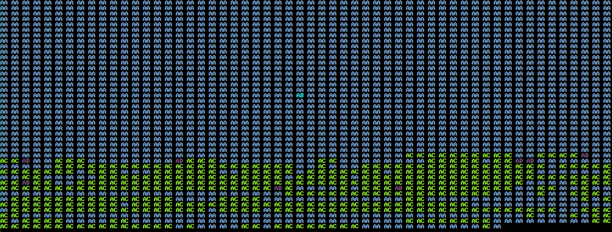

# repowatch

This tool lets you visualize who is committing to git repos over time. It collects all the pairs of name + email
associated with commits, assigns a unique identifier + color, and prints the symbol for the owner of each commit in the
repository.

You can also use the `-committer` flag to see who _committed_ the change.

## Example



## Usage

```
./repowatch [-committer] [repo path]
```
